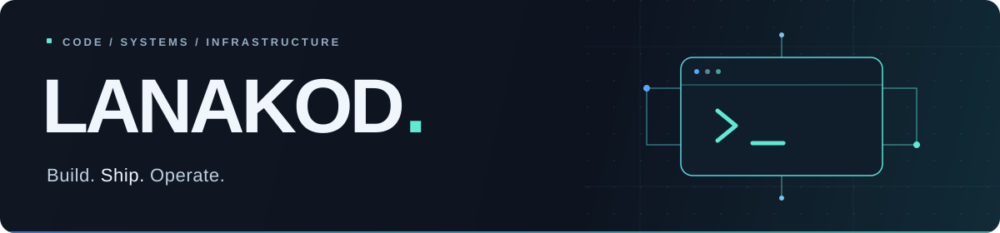
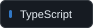
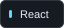
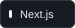
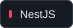
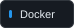
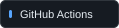
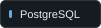
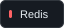

<p align="center">
  
</p>

<h1 align="center">Hi, I'm Maxim Malakhov 👋</h1>

<p align="center">
  <strong>Full-stack Developer · DevOps Engineer</strong><br />
  From TypeScript applications to the infrastructure that runs them.
</p>

<p align="center">
  <a href="https://t.me/lanakod">Telegram</a>
  &nbsp;·&nbsp;
  <a href="mailto:malakhovma@lanakod.com">malakhovma@lanakod.com</a>
  &nbsp;·&nbsp;
  <a href="https://github.com/Lanakod?tab=repositories">All repositories</a>
</p>

## What I build

I build web applications, tools for managing servers, and automation for everyday infrastructure tasks. My work spans backend APIs with **NestJS and Express**, interfaces with **React and Next.js**, and deployments with **Docker and Docker Compose**.

I care about clear types, maintainable code, and systems that are straightforward to deploy and operate.

## Selected projects

### [Samba Panel](https://github.com/Lanakod/samba-panel)

A web interface for managing Samba users and file shares. Edit configuration, inspect container status, and view logs from one place.

`TypeScript` `Next.js` `Docker` `amd64 / arm64`

### [Xray Subscription Updater](https://github.com/Lanakod/xray-subscription-updater)

Automates subscription downloads, Xray configuration generation, validation, and restarts. Keeps the existing configuration if an update fails.

`Python` `Docker` `Xray` `Automation`

### [Russian Android Apps](https://github.com/Lanakod/russian-android-apps)

A categorized collection of Android package names for per-app routing in compatible clients.

`Android` `Networking` `Routing lists`

## Core stack

<p>
  
  
  
  
</p>
<p>
  
  
  
  
</p>

<details>
<summary><strong>More technologies I work with</strong></summary>

| Area                   | Technologies                                           |
|:-----------------------|:-------------------------------------------------------|
| Languages              | TypeScript, JavaScript, Go, C#, Kotlin                 |
| Backend                | NestJS, Express, .NET, Socket.IO, Sequelize            |
| Frontend               | React, Next.js, Redux, Tailwind CSS                    |
| Infrastructure & tools | Docker, Docker Compose, Nginx, GitHub Actions, Swagger |
| Databases              | PostgreSQL, MongoDB, MySQL, Redis                      |

</details>

## A little more about me

```typescript
const lanakod = {
  name: "Maxim Malakhov",
  languages: ["ru_RU", "en_US"],
  focus: ["Full-stack development", "DevOps"],
  interests: ["Distributed systems", "Microservices"],
  motto: "Build it. Understand it. Keep it running.",
} as const;
```

---

<p align="center">
  Have a question about a project or an idea to discuss? <a href="https://t.me/lanakod">Let's talk.</a><br />
  <sub>DDD — Davai Davai Deploy.</sub>
</p>
